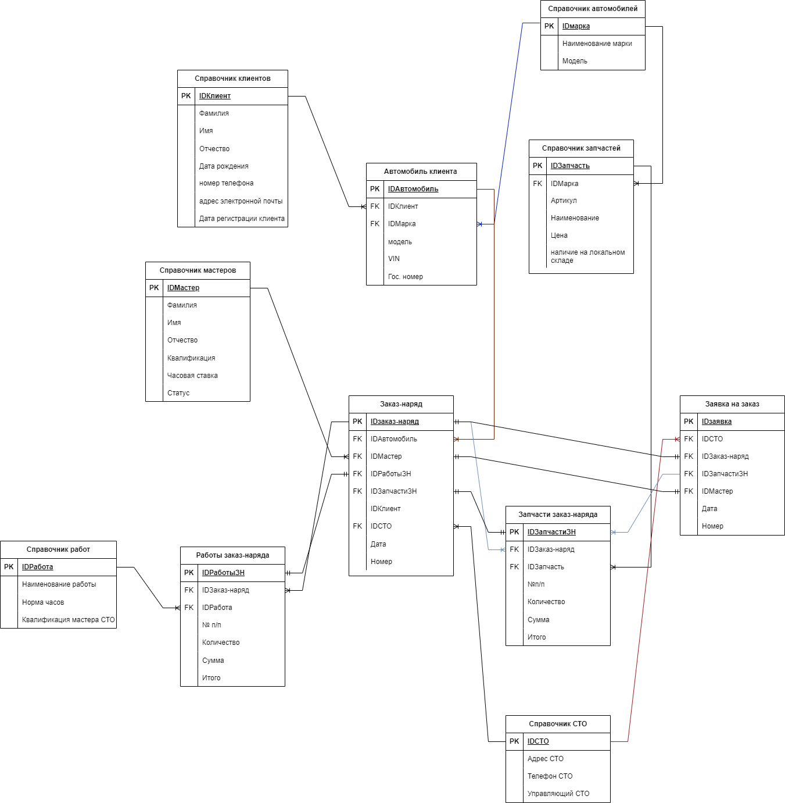

# Описание предметной области

## Сущности

| № | Наименование | Описание в реальном мире | Откуда появляется  | Где используется  |
| --- | --- | --- | --- | --- |
| 1 | Клиент | Человек, обращающийся на СТО | Клиенты обращаются на СТО за оказанием услуг для автомобилей | Используется для наполнения справочника клиентов |
| 2 | Автомобиль | Автомобиль конкретной марки и модели, принадлежащий одному (нескольким) клиентам | Клиент привозит автомобиль на диагностику/ ремонт | Используется для наполнения справочника автомобилей, для создания заказ-наряда |
| 3 | Мастер СТО | Сотрудник СТО в должности “мастер”, выполняющий работы в соответствии со квалификацией | Назначается управляющим СТО | Используется для наполнения справочника мастеров, для оказания услуг клиентам, для заказа запчастей  |
| 4 | Заказ-наряд | Документ, содержащий информацию о клиенте, автомобиле, необходимых работах и запчастях, исполнителе | Создается мастером СТО в момент обращения клиента на СТО | Используется для учета запчастей, для расчета заработной платы мастеров СТО, для выставления счета клиенту |
| 5 | Работы заказ-наряда | Список работ, которые необходимо провести по конкретному автомобилю в рамках одного заказ-наряда | Появляется после осмотра автомобиля мастером СТО и создания заказ-наряда | Используется для выставления счета клиенту, для расчета заработной платы мастеру СТО |
| 6 | Запчасти заказ-наряда | Запчасти, необходимые для выполнения работ  | Появляется после осмотра автомобиля мастером СТО и создания заказ-наряда | Используется для выставления счета клиенту, для оформления заказа на запчасти на склад |
| 7 | Справочник работ | Каталог, содержащий исчерпывающий список возможных работ | Создается в системе, регулярно актуализируется | Используется для заполнения части "работы заказ-наряда" в заказ-наряде |
| 8 | Справочник запчастей | Каталог, содержащий перечень всех возможных запчастей | создается в системе, регулярно дополняется | используется для заполнения части "запчасти заказ-наряда" в заказ-наряде |
| 9 | Заявка на заказ запчастей  | Документ для заказа запчастей со склада | Создается, если на СТО нет необходимых запчастей для ремонта | На склад |
| 10 | Справочник автомобилей | Каталог, содержащий информацию об марках и моделях автомобилей, которые могут обслуживаться на СТО | Создается в системе, актуализируется по мере необходимости | Используется для создания заказ-наряда  |
| 11 | СТО | Автосервис, находящийся по конкретному адресу  | Создается руководством организации | Используется для обслуживания авто в конкретном районе, для отправки запчастей в центрального склада |
| 12 | Справочник СТО | Каталог, содержащий информацию обо всех СТО предприятия | Создается в системе, актуализируется по мере необходимости | Используется для доставки запчастей с центрального склада |

## ER-диаграмма

Ссылка на диаграмму в хорошем качестве [https://drive.google.com/file/d/1Ef5zYUwmQiMVkb5FasmJTbNiQ7reeEnh/view?usp=sharing](https://drive.google.com/file/d/1Ef5zYUwmQiMVkb5FasmJTbNiQ7reeEnh/view?usp=sharing)

## Словарь данных

| № | Тип артефакта | Наименование | Тип данных | Длина | Обязательность | Описание  | Комментарии |
| --- | --- | --- | --- | --- | --- | --- | --- |
|  | сущность  | Клиент |  |  |  |  |  |
|  |  | IDКлиент | ID |  | да |  | присваивается в системе автоматически |
|  |  | Фамилия | string |  | да |  | предусмотреть возможность ввода двойной фамилии через дефис  |
|  |  | Имя | string |  | да |  |  |
|  |  | Отчество | string |  | нет |  |  |
|  |  | номер телефона | string |  | да  |  | автозамена 8 на +7; автоподстановка +7, если номер начали вводить с кода (с 9); формат финальной записи номера                  +7  (999) 999-99-99 |
|  |  | адрес электронной почты  | string |  | да  |  |  |
|  |  | дата регистрации клиента | date  |  | да  |  | формат YYYYMMDD |
|  | сущность | Автомобиль |  |  |  |  |  |
|  |  | IDАвтомобиль | ID |  | да |  | присваивается в системе автоматически |
|  |  | IDклиент | ID |  | да |  |  |
|  |  | IDмарка  | ID |  | да |  | присваивается в системе автоматически |
|  |  | Модель  | string |  | да |  |  |
|  |  | VIN автомобиля | string | 17  | да  |  | ввод только букв латинского алфавита, кириллица не вводится  |
|  |  | Гос. номер автомобиля | string |  | да  |  |  |
|  | сущность | Мастер СТО |  |  |  |  |  |
|  |  | IDмастер | ID |  | да |  | присваивается в системе автоматически |
|  |  | Фамилия | string |  | да |  | предусмотреть возможность ввода двойной фамилии через дефис  |
|  |  | Имя | string |  | да |  |  |
|  |  | Отчество | string |  | нет |  |  |
|  |  | Квалификация | enum |  | да  |  | одно из нескольких заранее определенных значений |
|  |  | Часовая ставка | real |  | да |  |  |
|  | сущность  | Заказ-наряд |  |  |  |  |  |
|  | блок  | Заказ-наряд |  |  |  |  |  |
|  |  | IDзаказ-наряд | ID |  | да |  | присваивается в системе автоматически |
|  |  | IDАвтомобиль | ID |  | да |  | присваивается в системе автоматически |
|  |  | IDМастер | ID |  | да |  | присваивается в системе автоматически |
|  |  | IDРаботыЗН | ID |  | да |  | присваивается в системе автоматически |
|  |  | IDЗапчастиЗН | ID |  | да |  | присваивается в системе автоматически |
|  |  | IDКлиент | ID |  | да |  | Необходимы будут ФИО в формате “Фамилия Имя Отчество” |
|  |  | IDСТО | ID |  | да |  | присваивается в системе автоматически |
|  |  | Дата | DateTime |  | да |  | системные дата/время  |
|  |  | Номер | Integer  |  | да |  | присваивается в системе автоматически |
|  | блок  | Работы заказ-наряда |  |  |  |  |  |
|  |  | IDРаботыЗН | ID |  | да |  | присваивается в системе автоматически |
|  |  | IDЗаказ-наряд | ID |  | да |  | присваивается в системе автоматически |
|  |  | IDРабота | ID |  | да |  | может быть выполнено несколько работ, один или несколько в блоке |
|  |  | № п/п | Integer |  | да |  | присваивается автоматически в системе, начиная с 1 с шагом +1 |
|  |  | Количество | Integer |  | да |  |  |
|  |  | Сумма | Real |  | да  |  | считается по формуле: норма часов * на количество * часовую ставку мастера |
|  |  | Итого  | Real |  | да |  | является результатом сложения всех данных "сумма" в данном блоке |
|  | блок | запчасти заказ-наряда |  |  |  |  |  |
|  |  | IDЗапчастиЗН | ID |  |  |  | присваивается в системе автоматически |
|  |  | IDЗаказ-наряд | ID |  |  |  | присваивается в системе автоматически |
|  |  | IDЗапчасть | ID |  |  |  | присваивается в системе автоматически |
|  |  | № п/п | Integer |  | да |  | присваивается автоматически в системе, начиная с 1 с шагом +1 |
|  |  | Количество | Integer |  | да |  |  |
|  |  | Сумма | Real |  | да  |  | считается по формуле: цена запчасти * на количество  |
|  |  | Итого  | Real |  | да |  | является результатом сложения всех данных "сумма" в данном блоке |
|  | сущность  | Справочник работ |  |  |  |  |  |
|  |  | IDРабота | ID |  | да |  | присваивается в системе автоматически |
|  |  | Наименование работы | string |  | да |  | проверка на орфографию при заполнении |
|  |  | Норма часов | real |  | да |  |  |
|  |  | Квалификация мастера | string |  | да |  | одно из нескольких заранее определенных значений |
|  | сущность | Справочник запчастей |  |  |  |  |  |
|  |  | IDЗапчасть | ID |  | да |  | присваивается в системе автоматически |
|  |  | IDМарка | ID |  | да |  | присваивается в системе автоматически |
|  |  | Артикул | string |  | да |  |  |
|  |  | Наименование  | string |  | да |  |  |
|  |  | Цена | real |  | да |  |  |
|  |  | наличие на локальном складе | boolean |  | да |  | значения “да” и “нет” |
|  | сущность | Справочник автомобилей |  |  |  |  |  |
|  |  | IDМарка | ID |  | да  |  | присваивается в системе автоматически |
|  |  | Наименование марки | string |  | да |  |  |
|  |  | Модель | string |  | да |  |  |
|  | сущность | заявка на заказ запчастей |  |  |  |  |  |
|  |  | IDЗаявка | ID |  | да |  | присваивается в системе автоматически |
|  |  | IDСТО | ID |  | да |  | присваивается в системе автоматически |
|  |  | IDЗаказ-наряд | ID |  | да |  | присваивается в системе автоматически |
|  |  | IDЗапчастиЗН | ID |  | да |  | присваивается в системе автоматически |
|  |  | IDМастер | ID |  | да |  | присваивается в системе автоматически |
|  |  | Дата | DateTime |  | да |  | системные дата/время  |
|  |  | Номер  | Integer |  | да |  | присваивается в системе автоматически |
|  | сущность | справочник СТО |  |  |  |  |  |
|  |  | IDСТО | ID |  | да |  | присваивается в системе автоматически |
|  |  | Адрес | string |  | да |  | связь с КЛАДР  |
|  |  | Телефон СТО | string |  | да |  | номер в формате +7 (999) 999-99-99 |
